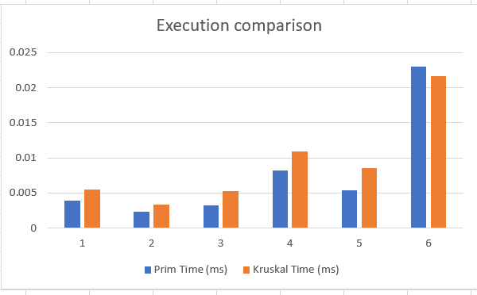

## Minimum Spanning Tree Algorithm Analysis Report

*Author: Nazym Kurmanbayeva* 

*Group: SE-2435*
### 1. Summary of Input Data and Algorithm Results

My input data included 6 graphs (2 graphs for each size: small, medium, large), with half of them being dense and the other half sparse, so I could observe the efficiency of both algorithms under different conditions.

I used 2 algorithms to find the minimum spanning tree or the most efficient transport systems: **Prim's** and **Kruskal's** algorithms. Here are the results based on the output data:

| Graph ID | Vertices | Edges | Prim Cost | Kruskal Cost | Prim Time (ms) | Kruskal Time (ms) | Prim Ops | Kruskal Ops |
|----------|----------|-------|-----------|--------------|----------------|------------------|----------|-------------|
| 1        | 5        | 5     | 14        | 14           | 0.0039         | 0.0055           | 5        | 5           |
| 2        | 5        | 10    | 14        | 14           | 0.0023         | 0.0033           | 10       | 10          |
| 3        | 12       | 16    | 49        | 49           | 0.0032         | 0.0053           | 16       | 16          |
| 4        | 12       | 46    | 45        | 45           | 0.0082         | 0.0109           | 46       | 46          |
| 5        | 25       | 46    | 133       | 133          | 0.0054         | 0.0086           | 46       | 46          |
| 6        | 25       | 147   | 110       | 110          | 0.0230         | 0.0217           | 147      | 147         |

As you can notice, the data varies significantly, especially when comparing execution times. However, the weights of the MST are identical for both algorithms, and even the operation counts are the same.

### Performance Measurement Methodology

At first, my execution time was quite high, and I was frustrated to see that small graphs took more time to execute compared to bigger graphs. So I decided to run each graph **1000 times** and find the average, minimizing the impact of garbage collection and JVM warm-up.

From my `Metrics` class:
```java
public double measureExecutionTime(Runnable algorithm, int repetitions) { 
    long totalTime = 0; 
    for (int i = 0; i < repetitions; i++) { 
        start(); 
        algorithm.run(); 
        stop(); 
        totalTime += (endTime - startTime); 
    } 
    return totalTime / 1_000_000.0 / repetitions; 
}
```

### 2. Comparison Between Prim's and Kruskal's Algorithms

When comparing the two algorithms in terms of efficiency and performance, we can observe that in most cases, **Prim's algorithm** takes much less time compared to **Kruskal's algorithm**. Only in the last graph, which was quite dense (25 vertices and 150 edges), Kruskal's algorithm was quicker than Prim's algorithm by 0.0013 milliseconds.

### Algorithm Performance Comparison


Comparison of execution times for Prim's and Kruskal's algorithms across different graph sizes and densities

### Theory vs. Practice

**Theoretical expectations:**
- **Prim's algorithm:** O(E log V) — more efficient for dense graphs
- **Kruskal's algorithm:** O(E log E) — more efficient for sparse graphs

**Practical results:**
The only case when Kruskal's algorithm was more efficient was the last graph (Graph 6) with many cities and a dense road system, where in theory it should have been less efficient. So ironic.

### 3. Conclusion

When discussing the efficiency of both algorithms in terms of graph density:
- For **dense graphs**, we should use **Prim's algorithm**
- For **sparse graphs**, we should use **Kruskal's algorithm**

This is because Prim's algorithm is vertex-based, whereas Kruskal's algorithm is edge-based, so the number of edges can significantly affect performance and execution time.

However, in practice, it seems like **Prim's algorithm performed best in most cases**.

### Implementation Considerations

From an implementation perspective, writing Prim's algorithm was much easier for me personally. The only thing you need to understand is how the "Visited" list works and when to add edges to the MST.

Compared to that, Kruskal's algorithm was much trickier, requiring me to create a separate DSU class for the algorithm to work smoothly.

---